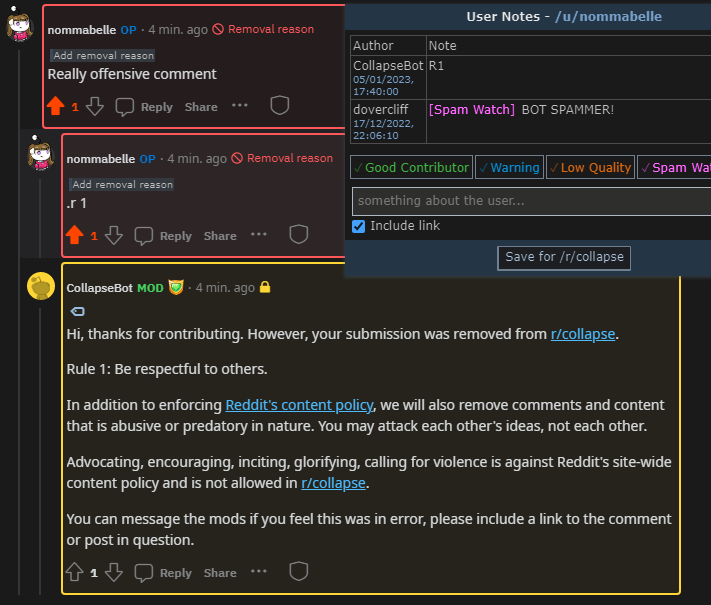
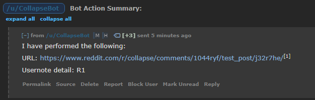
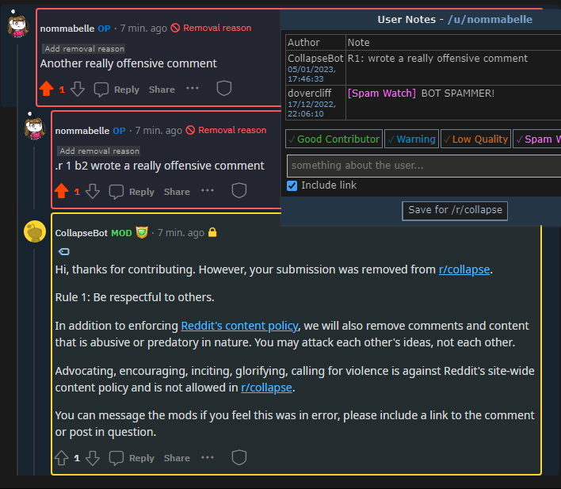
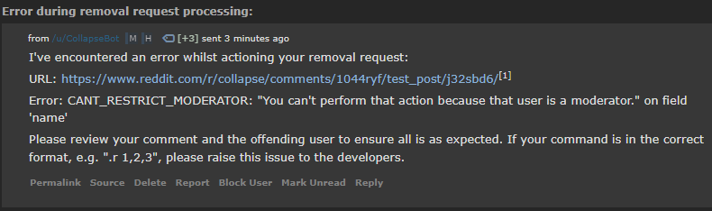
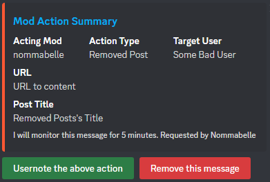
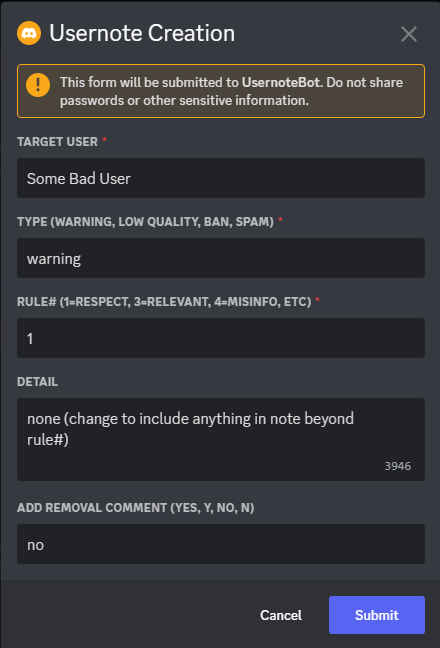
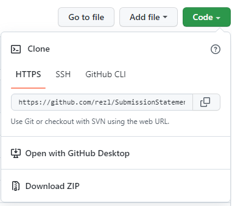

# Overview
usernotebot enables writing usernotes or removal comments by [/r/collapse](https://www.reddit.com/r/collapse) moderators via discord or reddit. This is targeted at creating a better mobile modding experience
Prompt bot in discord (Collapse server or bot DM) with `.help` and `.help usernote`

# Details
## REDDIT Workflow:
1. Comment on offending content with bot command
   1. Note, bot will respond even if your comment is not distinguished
2. Bot will action the command
3. Bot will respond to you with a summary performed, or if there is an issue

### Command Structure:
1. Base command:
   1. `.r` = remove
      1. Removes the offending content
      2. Optionally bans
   2. `.n` = note 
      1. Usernotes the content, but does not remove
      2. DOES NOT BAN (if the content is bad enough for ban, it's bad enough to be `.r`'d) - if included in command, it is ignored
2. Optional inclusions, MUST BE IN THIS ORDER (each one is optional)
   1. Rule Set
      1. Examples: `1` or `1,2,3` or `1;5;2` or `1.4`
         1. Does NOT work: `1 2 3` or `1;2.3` 
      2. The rules broken by this content (note, MUST be numbers separated by `,` `.` or `;`)
         1. E.g. 1 = Rule 1, be respectful to others
   2. Ban Command
      1. All supported options:
         1. **numbers** = ban length in days
            1. E.g. `b1` `b4` `b10` `b31`
         2. **i for incremental** = looks up the last ban length, and multiplies this by 2
            1. E.g. `bi` on user with a prior 3d ban will ban them 6 days
         3. **p for permanent** = permanently bans the user
   3. Message 
      1. Remaining part of command
      2. This is included in the usernote
   4. More details on the command structure:
      1. It's designed to be as concise as possible to cater towards mobile modding
      2. If you do not include a section, or improperly format it, the bot will look at the next optional part
         1. I.e. if you say "bo" instead of "bi", the bot will NOT ban, but your message would include "bo" + message

Command Structure Examples:
* `.r 1`
  * Remove, citing rule 1
  * Bot removes user content, with a removal message, citing rule 1
  * Bot leaves a usernote "R1"


* `.r 1,2 bi advocating for violence`
  * Remove, citing rules 1 + 2, incremental ban, with message
  * Bot removes user content, with a removal message, citing rules 1 and 2
  * Bot bans user for 2 days (assume last ban 1 day), citing rules 1 and 2
  * Bot leaves a usernote "advocating for violence"
* `.r b1 user needs a timeout for being mean`
  * Remove, citing no rules, 1 day ban, with message
  * Bot removes user content, with a removal message (no cited rules, as not included)
  * Bot bans user for 1 day, citing nothing (as no rules included)
  * Bot leaves a usernote "user needs a timeout for being mean"
* `.r 1.3,4 basdf really cool message`
  * Remove, citing no rules (incorrect format), no ban (incorrect format), message "1.3,4 basdf really cool message"
  * Bot removes user content, removal messages (no cited rules)
  * Bot doesn't ban
  * Bot leaves a usernote "1.3,4 basdf really cool message"
* `.r bi 1,2,3 message`
  * Remove, citing no rules (format), no ban (format), message "bi 1,2,3 message"
  * This request would be correct, but is in the incorrect format to action
  * Bot removes content, removal message (no cited rules), no ban
  * Usernote = "bi 1,2,3 message"

If there is an issue during removal, the bot will attempt to do everything it can (comment removals, ban, uesrnote), but you should review the removals/bans manually (and also tell the developer)
Example, attempting to ban a mod:



## DISCORD Workflow:
1. Prompt bot in discord (Collapse server or bot DM), eg `.usernote`


3. The bot will respond with your recent comment or post removal action(s)



4. Click the respective button to usernote or remove the embed
5. Fill out the usernote prompt and submit



6. Congrats! You've usernoted! 
   1. You could write a usernote with simply 3 easy actions:
      1. `.usernote`
      2. Click green button
      3. Click Submit, which would create a usernote "R1"

## Mod Action Summary:
* Mod Action Summary: url to the actioned content
* Acting Mod: your name from the mod action
* Action Type: removed comment or post
* Target User: the user actioned by this mod action
* URL: url to the content (to help mod identify content)
* Post Title: if post
* Comment Body: if comment


## Usernote Creation:
* Target User: user to usernote
* Type: the usernote type, included in the usernote (see below)
* Rule# (integer): rule broken (must match the rule in the subreddit, i.e. `1` would indicate R1 has been broken. This is included in both the usernote and removal reason
* Detail (optional): more detail on the usernote. NOT included in the removal comment
* Add Removal Comment (optional, y/n): if yes, bot will also add a removal reason indicating the rule broken


## Note:
* The bot also responds to `.un` `.a` `.act` `.action`, to provide best mobile experience (ie fewest typing)
* All reddit actions are by the bot (usernotes, comments)
* Your discord server or display name must match your Reddit username
* The supported usernote types are (using any of the [] will map to the left-most word)
```
ban: ['b', 'ban']
spamwatch: ['spam', 'sw']
low_quality: ['low_quality', 'low quality', 'lq']
abusewarn: ['abusewarn', 'abuse warn', 'aw']
permban: ['permban', 'perm ban', 'perm']
None: [None, '(empty)', 'empty', 'null', 'no', 'n/a']
warning: ['warning', 'warn']
spamwarn: ['spamwarn', 'spam warn']
gooduser: ['gooduser', 'good', 'gu']
low_quality_contributor: ['low_quality_contributor', 'low quality contributor', 'lqc']
```


# Requirements
- Python 3.10+
- praw 6.3.1+
- discord 2.1.0+
- [pmtw](https://github.com/adhesivecheese/pmtw) 1.1.2+

# BOT SETUP

## Setup Git
1. [Create a Github account.](https://github.com/join)

2. [Go here and install Git](https://git-scm.com/book/en/v2/Getting-Started-Installing-Git) if you don’t have it already.

3. [Assuming you're reading this on the repo page](https://github.com/rezl/SubmissionStatementBot), select ‘fork’ to create a copy of it to your Github account. 

4. From your new repo, select **Code** and then under **Clone** copy the HTTPS URL (e.g. https://github.com/rezl/SubmissionStatementBot.git) to download a local copy



5. Navigate to a folder you want a local copy of the repo to live, and clone the Github repo to your local PC:
   1. It's up to you where to put the repo - recommended in a folder like C:\<username>\Documents\ or a new folder, C:\<username>\Documents\Programming
   2. `git clone <url>`
      1. e.g. `git clone https://github.com/rezl/SubmissionStatementBot.git`
   3. Make note of (copy/paste somewhere) of the folder you clone to for future reference

6. Make note of (copy/paste somewhere) your Reddit app’s Client ID. This the string directly under **personal use script**. This is your Reddit App Client ID.

7. Make note of (copy/paste somewhere) the URL linking to your repo (e.g. https://github.com/yourusername/collapse). This is your Github Repo URL.


## Setup Reddit
1. [Create a new Reddit account](https://www.reddit.com/register/?dest=https%3A%2F%2Fwww.reddit.com%2F) with the name you’d like for your bot.

2. Login into your primary Reddit account which moderates your subreddit.

3. Go to https://old.reddit.com/r/YOURSUBREDDIT/about/moderators/ and invite the bot to become a moderator with full permissions.

4. Log back into the bot’s account and accept the invitation.

5. Go to https://old.reddit.com/prefs/apps/ and select **Create and app**

6. Type a name for your app and choose **script**.

7. Write a short description of what your bot will be doing.

8. Set the **about URI** to your Github Repo URL.

9. Set the **redirect URI** to your Heroku Git URL. 

10. Select **create app**.

11. Make note of the secret code for the next steps.


## Setup Discord
Find some guide for it


## Configure the Bot
1. Open the folder containing local copy of your repo from Setup Git > step 5

2. Open **bot.py**

3. Change settings how you'd like (settings.py)

5. Save the file.

6. If not configured in Fly.io (Setup Fly step 9), Open **config.py** and fill in these fields with your info. Make sure not to remove the apostrophes surrounding them.
```
BOT_USERNAME = 'ReallyCoolBot'
BOT_PASSWORD = 'password'
CLIENT_ID = 'asdfasdfasdf'
CLIENT_SECRET = 'asdfasdfasdf'

DISCORD_TOKEN = 'asdfasdfasdfY'
DISCORD_ERROR_GUILD = 'SomeDiscord'
DISCORD_ERROR_CHANNEL = 'SomeDiscordChannel'
DISCORD_COLLAPSE_GUILD = 'AnotherDiscord'

SUBREDDITS = 'Subreddit'
```
When config is not provided in Fly, the bot will attempt to use config from this file.

9. Save the file.

10. Optionally run the bot locally - settings.py's "is_dry_run" can be set to "True" to run the bot without it making any changes (report, remove, reply to posts)


## Setup Fly.io
- The main advantage of Fly.io is their base (hobby) plan includes enough hours to host this bot for free. This guide assumes you’re using Windows and this bot's code, but should work for getting a general Reddit bot running on Fly.io as well.
- Hosting this bot alongside other apps in your Fly account may incur costs if the cumulative resource usage is beyond free limits

1. Create a Fly account. This is the service which will be running the bot.

2. Create your new Fly application from the command line, references:
   1. [Speedrun setup](https://fly.io/docs/speedrun/)
   2. Fly.io webpage, cannot create Python apps from here, reference only ([main page](https://fly.io/dashboard/personal) > ["Launch an App"](https://fly.io/dashboard/personal/launch))
   3. [Non-fly guide](https://jonahlawrence.hashnode.dev/hosting-a-python-discord-bot-for-free-with-flyio)

3. Open powershell on your PC from Windows search "Windows Powershell"

4. Install fly.io tooling by copy pasting this command into the powershell terminal:
   1. https://fly.io/docs/hands-on/install-flyctl/#windows
   2. `iwr https://fly.io/install.ps1 -useb | iex`

5. Log in to fly from your terminal with:
   1. https://fly.io/docs/hands-on/sign-in/
   2. `flyctl auth login`

6. Navigate to the folder you extracted or cloned the git repo to (Setup Git > step 7)

7. Launch a new app to fly.io with:
   1. https://fly.io/docs/hands-on/launch-app/
      1. You will want to override the existing fly.toml file, as the app name is included in this file
   2. `flyctl launch`

8. Verify you see the fly app on your [fly webpage](https://fly.io/dashboard)

9. Add the required config for your bot to Fly.io (added to Fly to keep sensitive info private) via command line:
   1. app page (https://fly.io/apps/<appname>) > Secrets
   2. Reference: https://fly.io/docs/reference/secrets/#setting-secrets
   3. `flyctl secrets set BOT_USERNAME=BotRedditUsername`
   4. Add your each secret individually with above command (after set, they are encrypted and not readable):
```
BOT_USERNAME = 'ReallyCoolBot'
BOT_PASSWORD = 'password'
CLIENT_ID = 'asdfasdfasdf'
CLIENT_SECRET = 'asdfasdfasdf'

DISCORD_TOKEN = 'asdfasdfasdfY'
DISCORD_ERROR_GUILD = 'SomeDiscord'
DISCORD_ERROR_CHANNEL = 'SomeDiscordChannel'
DISCORD_COLLAPSE_GUILD = 'AnotherDiscord'

SUBREDDITS = 'Subreddit'
``` 

10. Deploy your new app to fly.io with:
    1. https://fly.io/docs/hands-on/launch-app/ > "Next: Deploying Your App"
    2. `flyctl deploy`

11. Monitor app from Fly.io, or command line:
    1. https://fly.io/apps/<app-name>
    2. https://fly.io/apps/<app-name>/monitoring
    3. `flyctl status`
    4. You should now see the bot in action. You can check your subreddit to see whatever changes it made (if any) as well as make a test post to ensure it's working properly.


## Integrate Fly.io and Github for automatic deployments
- Automatically deploys your code to Fly.io when changes are pushed to the Github repo's master branch
- Without this step, you will manually deploy the app from command line as needed with `flyctl deploy`

1. Obtain an authentication token, which will tell fly.io which application you are deploying to:
   1. On command line, `flyctl auth token`

2. From your Github forked repo, add this auth token as a secret
   1. [Non-fly guide](https://jonahlawrence.hashnode.dev/hosting-a-python-discord-bot-for-free-with-flyio#heading-continuous-deployment-from-github)
   2. Go to your repo's Settings > Secrets > Actions and click New repository secret

3. Now, whenever you add to your repo's master branch, it will automatically deploy to fly.io
   1. You can prevent automatic deployments by removing this auth token from github, or removing the fly.yml file (.github/workflows/fly.yml)
   2. You can cancel individual deployments whilst it's running:
      1. Navigate to Actions Page (https://github.com/<username>/<reponame>/actions), which lists all previous and ongoing deployments
      2. Click on the current deployment (yellow circle) > Cancel Workflow 
